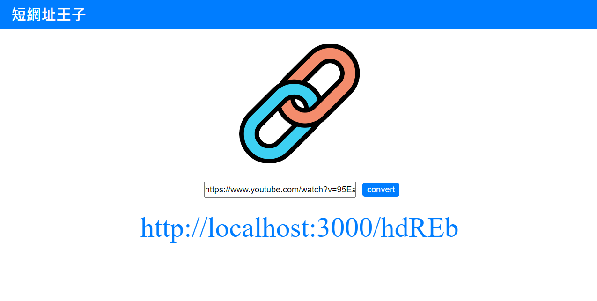

# **短網產生器**

實作短網址產生與轉址功能

&nbsp;
## **專案功能**

* 使用者輸入原始網址並送出後，畫面回傳短網址給使用者
* 短網址輸出格式為：伺服器名稱 +5 碼英數組合亂碼
* 在伺服器啟動期間，使用者可以在瀏覽器的網址列，輸入專案提供的短網址，瀏覽器就會導向原本的網站

&nbsp;
## **環境建置與需求**

* [Node.js](https://nodejs.org/en/) - v16.14.2
* [MongoDB](https://www.mongodb.com/zh-cn/cloud/atlas/efficiency) - Atlas


&nbsp;
## **安裝與執行步驟**

> 下載或複製專案後

１.在專案資料夾中使用終端機

```properties
cd 'file name'
```

２.安裝node套件

```properties
npm install
```

３.設定MongoDB資料庫
> 設定環境變數 MONGODB_URI 為資料庫URI

> 或於config資料夾 mongoose.js 第3行 修改連線資料庫
```js
mongoose.connect('資料庫URI', { useNewUrlParser: true, useUnifiedTopology: true })
```

４.執行專案
> node
```properties
npm run start
```

> nodemon(視需求)

```properties
npm run dev
```

５.在瀏覽器上瀏覽專案

```
http://localhost:3000
```

專案啟動成功時，終端機輸出
```
Listening on http://localhost:3000
```
資料庫連接成功時，終端機輸出
```
mongodb connected
```

６.瀏覽佈署於heroku的專案
```
http://psurl.herokuapp.com
```

&nbsp;
## **專案畫面**


